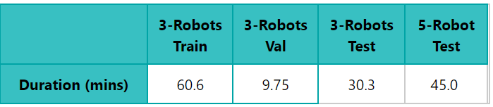
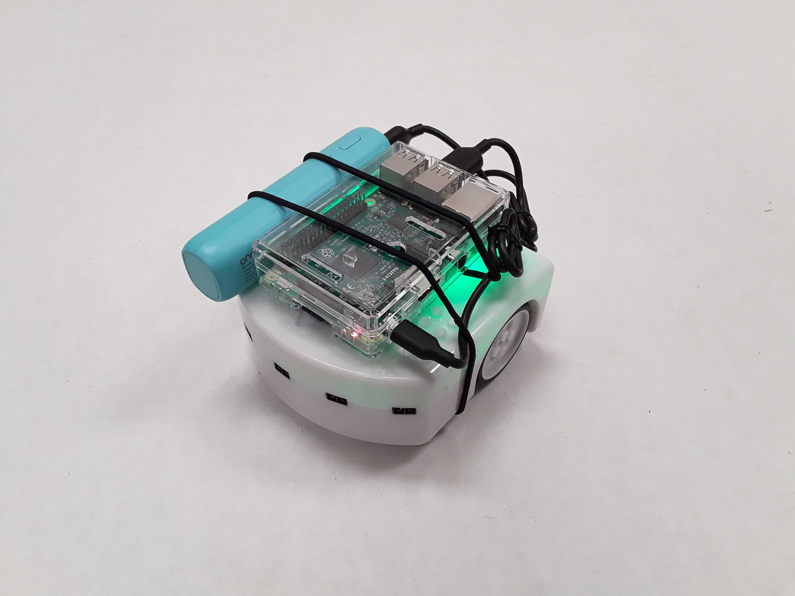
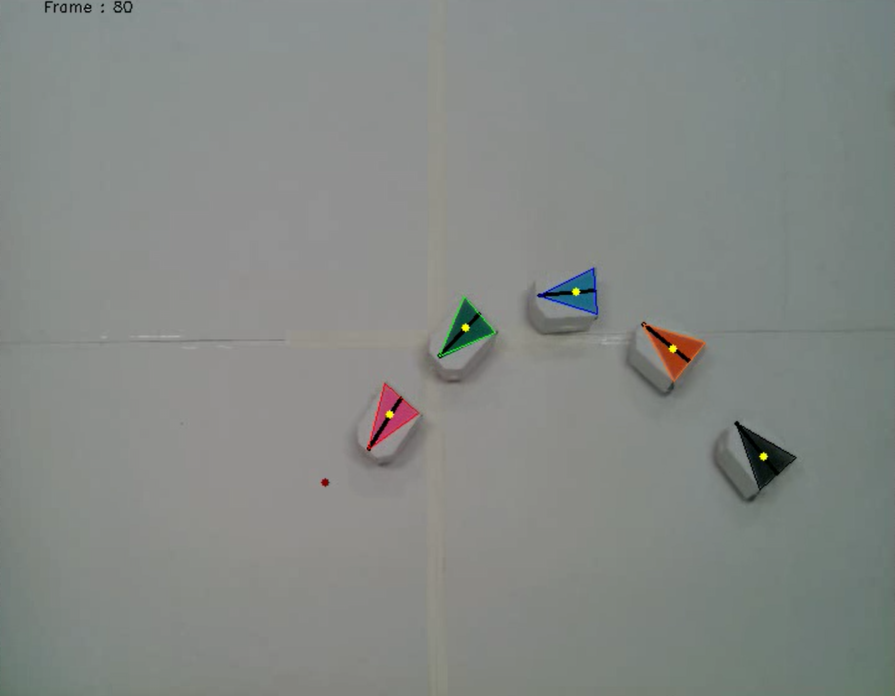
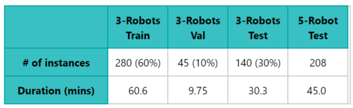

# Learning local behavioral sequences to better infer non-local properties in real multi-robot systems
---
By Taeyeong Choi, Sehyeok Kang, and Theodore P. Pavlic

<!-- ## Prerequisite -->
<!-- - Python v3.6 -->
<!-- - Tensorflow v1.14 -->
<!-- - Jupyter Notebook v5.7.8 -->
<!-- - Tested in Google's official docker image avilable at [Link](https://www.tensorflow.org/install/docker) -->

## Dataset 

We attach *Thy-ReTLo*, a dataset specialized for 
*Remote Teammate Localization (ReTLo)* on a commercial, two-wheeled 
robotic platform, *Thymio* [2],
where a robot in a multi-robot team only uses observation about its nearest neighbor to infer 
the locations of all other far teammates. The dataset provides global coordinates and orientation of 
each robot, collected from real *Thymio* robots. The recording occured twice per second by a central 
computer monitoring and detecting the change of locations through a overhead camera. We offer two separate 
cases based on the team size: 3-robot team and 5-robot team. 

All teams bulid upon the motion rules defined in [1] according to the role of robot. 
We encourage to train an inference model only in the 3-robot team and execute it 
not only in the same size but also in the 5-robot case. 
Thus, we utilize 60\% and 10\% of data from 3-robot team as Training and Validation set, respectively. 
The rest of 20\% from 3-robot team and all from the 5-robot are used to test the finally obtained model. 

More details about the proportions are shown below: 

    

## Robot and Arena

A commercial, two-wheeled robotic platform, *Thymio*, is used for all data collection. 
Each robot is powered by a Raspberry Pi, which communicates with a central monitoring computer 
via an overhead camera to simulate a better proximity sensor and 
a virtual GPS system.
Through the communication, the *Thymio*'s can determine the next 
motion. 

Also, an arena of size 2.5m x 1.9m  is used across all 
types of recordings, on which all robots covered by 
cardboards, for better detection, are programmed to 
move, as shown below:  

 
    
    

## Usage

The csv data from *k*-robot team is located in *./Datasets/kRobots*. 
Each row contains an instance of pose information for all robots, recorded
in global coordinates for 26 sequenctial time steps (13 seconds).
*t_r_x*, *t_r_y*, and *t_r_o* are the x,y-coordinates and orientation of *r* robot at 
timestep *t*. 
Since the recording was performed such that the instances have at least *7*-second time gap 
among them, it can be said that there is little motional dependency between any two instances. 
The number of instances for each case are described below:

 
    

## Contact 

If you have any questions on use of this data, please send an email to *tchoi4@asu.edu*. 

## References 

[1] Taeyeong Choi, Theodore P. Pavlic, Andrea W. Richa, 
Automated synthesis of scalable algorithms for inferring non-local properties to assist in multi-robot teaming, 
13th IEEE Conference on Automation Science and Engineering (CASE), 2017.

[2] https://www.thymio.org/

[3] https://www.raspberrypi.org/products/raspberry-pi-3-model-b/