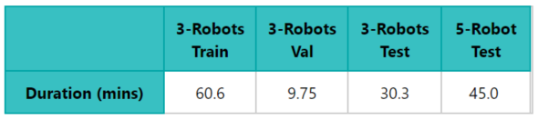

# Learning local behavioral sequences to better infer non-local properties in real multi-robot systems
---
By Taeyeong Choi, Sehyeok Kang, and Theodore P. Pavlic

<!-- ## Prerequisite -->
<!-- - Python v3.6 -->
<!-- - Tensorflow v1.14 -->
<!-- - Jupyter Notebook v5.7.8 -->
<!-- - Tested in Google's official docker image avilable at [Link](https://www.tensorflow.org/install/docker) -->

## Dataset 

We attach *ThymioL*, a dataset specialized for *Remote Teammate Localization (RTL)*,
where a robot in a multi-robot team only uses observation about its nearest neighbor to infer 
the locations of all other far teammates.   
The dataset provides global coordinates and orientation of each robot, collected from each real *Thymio* robot.
The recording occured twice per second by a central computer monitoring and detecting the change of 
locations through a overhead camera. 
We offer two separate cases based on the team size: 3-robot team and 5-robot team. 

All teams bulid upon the motion rules defined in [1] according to the role of robot. 
We encourage to train an inference model only in the 3-robot team and execute it 
not only in the same size but also in the 5-robot case. 
thus, we utilize 60\% and 10\% of data from 3-robot team as Training and Validation set, respectively. 
The rest of 20\% from 3-robot team and all from the 5-robot are used to test the finally obtained model. 

More details about the proportions are shown below: 

## References 

[1] Taeyeong Choi, Theodore P. Pavlic, Andrea W. Richa, 
Automated synthesis of scalable algorithms for inferring non-local properties to assist in multi-robot teaming, 
13th IEEE Conference on Automation Science and Engineering (CASE), 2017